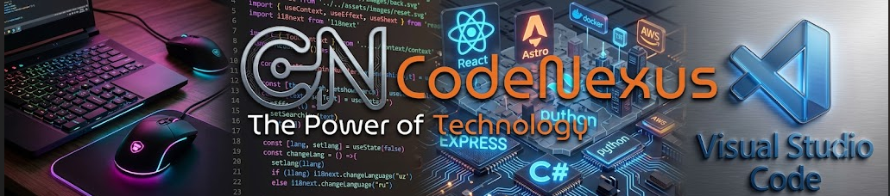

  <!-- Header Banner -->
  

    

  <h1>Hi there, I'm <a href="https://github.com/ShahanCodes">Shahan</a> 👋</h1>
  <h3><code>CodeNexus</code> — <i>Building in silence, scaling with impact.</i></h3>

  

    An introverted, detail-oriented developer passionate about crafting high-performance web applications, clean UI/UX, and robust digital systems.
  

  

    
    
    
  

---

### 🐙 About Me & CodeNexus

> **CodeNexus** represents the core hub where logic, modern web technologies, and clean architecture converge.

* 🔭 **Current Focus:** Advanced Front-end Web Development & UI Engineering.
* ⚡ **Operating System & Workflow:** Configured custom Linux (Ubuntu) environment & Neovim workflow.
* 🎨 **Creative Arts:** 3D Modeling & Rendering enthusiast.
* 🎯 **Philosophy:** *"Crafting clean logic and seamless digital experiences behind the scenes."*

---

### 💻 Tech Stack & Tools

| Area | Technologies |
| :--- | :--- |
| **Languages** | `JavaScript (ES6+)` `HTML5` `CSS3` `Python` `C#` |
| **Frameworks & Libs** | `React` `Astro` `Express.js` `Tailwind CSS` |
| **Tools & Environment** | `VS Code` `Neovim` `Ubuntu / Linux` `Git & GitHub` |
| **Cloud & DevOps** | `Docker` `AWS` |

 

#### 🚀 Badges

---

### 📊 GitHub Stats

---

*Designed & Developed with ❤️ by **CodeNexus**.*

"""

with open("README.md", "w", encoding="utf-8") as f:
    f.write(readme_content)

print("File README.md successfully generated!")
