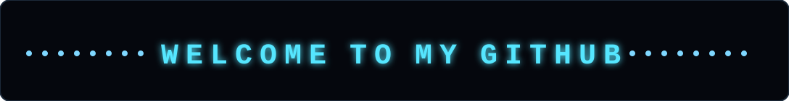

<div align="center">
  
</div>
<br>
  <a href="https://git.io/typing-svg">
    
  </a>
</div>

<div align="center">
    <a href="https://instagram.com/shahan__syah"></a>
    <a href="https://tiktok.com/@superhann07"></a>
    <a href="https://www.facebook.com/share/1CzNu71Jbc/"></a>
    <a href="https://x.com/Shahansyah16950"></a><br>
    <a href="https://www.linkedin.com/in/shahansyah-naufal-015b6030b?utm_source=share_via&utm_content=profile&utm_medium=member_android"></a>
    <a href="https://t.me/ShahanSyah"></a>
</div>

## 👻 A little about me... 
<a href="https://github.com/shahansyah">
  
</a> 
<br>
<p align="justify">
  👋 <b>Hi,I'm Muhammad Shahan Syah Naufal Abdullah!</b> A passionate <b>Full-Stack Developer</b> who loves bridging the gap between intuitive front-end designs and robust back-end systems. I enjoy building seamless web applications, exploring modern technologies, and turning complex problems into clean, efficient code. When I’m not coding, you’ll probably find me tweaking my dev setup or diving into new tools!
</p>
At the moment, I’m learning about lots of tools and frameworks that I’m still unfamiliar with, as I’m convinced that learning as much as possible is essential for further development....😄️

```js
const shahansyah = {
  OS: ["Ubuntu"],
  languages: {
    highLevel: ["Python", "SQL"],
    averageLevel: ["JavaScript", "TypeScript"],
    baseLevel: ["HTML5", "CSS3",]
  },
  frameworksAndLibraries: {
    frontend: ["React", "Next.js", "Tailwind CSS"],
    backend: ["Node.js", "Express.js"],
    databases: ["PostgreSQL", "MongoDB", "MySQL"]
  },
  toolsAndDevEnvironment: {
    editor: ["VS Code"],
    terminal: ["WezTerm",],
    versionControl: ["Git", "GitHub"],
    devOps: ["Docker", "Nginx"]
  }
};
```

# 💻 Tech Stack:
                     
# 📊 GitHub Stats:
 <div align="center">
   
<br/>
<br/>

   
</div>


### ✍️ Random Dev Quote


---


<br>
<div align="center">

</div>


<div align="center">
  
</div>

